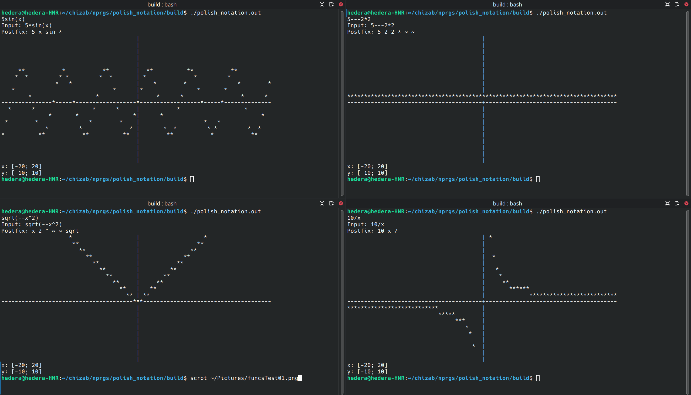

# Overview

Code for working with mathematical expressions in **infix and postfix notations**, implementing the following main operations:

1. **Conversion of infix notation to postfix notation** (Reverse Polish Notation)
2. **Evaluation of postfix expressions**
3. **Plotting graphs** of mathematical expressions within a specified range

The code is written in C and uses a stack-based approach.

## Table of Contents

1. [Features](#features)
    - [Conversion from Infix to Postfix Notation](#1-conversion-from-infix-to-postfix-notation)
    - [Evaluation of Postfix Expressions](#2-evaluation-of-postfix-expressions)
    - [Graph Plotting](#3-graph-plotting)
2. [Project Structure](#project-structure)
3. [Input of the Initial String](#input-of-the-initial-string)
4. [Dijkstra's Algorithm - Conversion of Infix Notation to Postfix](#dijkstras-algorithm---conversion-of-infix-notation-to-postfix)
    - [Logical Correctness Check of the Expression](#logical-correctness-check-of-the-expression)
    - [Implementation of Dijkstra's Algorithm](#implementation-of-dijkstras-algorithm)
    - [Example Usage of the `infix_to_postfix` Function](#example-usage-of-the-infix_to_postfix-function)
5. [Postfix Notation Calculator](#postfix-notation-calculator)
    - [Description of the Postfix Notation Calculator Code](#description-of-the-postfix-notation-calculator-code)
6. [Graph Plotting](#graph-plotting)
    - [Description of the Code](#description-of-the-code)
7. [Usage Example](#usage-example)

## Features

### 1. Conversion from Infix to Postfix Notation

- **Supported Mathematical Operators:**
  - `+`, `-` (unary and binary)
  - `*`, `/`, `^`

- **Supported Functions:**
  - `sin`, `cos`, `tan`, `cot`, `sqrt`, `ln`

- **Description:**
  - The expression is converted using a stack for operators.

### 2. Evaluation of Postfix Expressions

- **Supported Mathematical Operators:**
  - `+`, `-` (binary), `~` (unary)
  - `*`, `/`, `^`

- **Supported Functions:**
  - `sin`, `cos`, `tan`, `cot`, `sqrt`, `ln`

- **Description:**
  - The expression is evaluated using a stack for operands.

### 3. Graph Plotting

- **Functionality:**
  - Computes an array of values for the expression within a specified range.
  - Plots a simple graph using text symbols in the terminal.

## Project Structure

```plaintext
polish_notation/
├── build/                  # Directory for executable files
│   └── (automatically created during build using Makefile)
├── images/                 # Directory for images used in README
├── README.md               # README in English
├── README_RUS.md           # README in Russian
└── src/                    # Source code of the project
    ├── dejkstra_alg/       # Implementation of Dijkstra's algorithm
    ├── graph/              # Module for graph plotting
    ├── input/              # Module for expression input
    ├── objs/               # Directory for object files
    ├── polish_calc/        # Module for calculating expressions in postfix notation
    ├── stack/              # Stack implementation
    ├── whotype/            # Helper functions (similar to ctype)
    ├── main.c              # Entry point of the program, calls main functions
    └── Makefile            # Makefile for building the project
```

## Input of the Initial String

`./src/input/`

To input the initial string to be processed, functions described in the files `input_expr.c` and `input_expr.h` are used. The main input function:

- **`input_expr(char **const str)`**: Takes a pointer to a string where the entered expression will be stored. Returns the length of the string. Possible return codes:
  - `0`: The string is empty
  - `-1`: Memory allocation error

To simplify working with the expression, the multiplication sign between numbers and functions or variables can be omitted (`4x`, `5sin(0.5x)`). The following functions are implemented for this purpose:

- **`int space_clear(char **const str, int const len)`**: Removes unnecessary spaces from the string. Example: converts `2 sin(x)` to `2sin(x)`, but leaves `4 4` unchanged.

- **`int insert_mul(char **const str, int const len)`**: Inserts missing multiplication signs in expressions where necessary. Example: converts `4x` to `4*x`.

An error output function is also provided:

- **`input_err(int const err_code)`**: Outputs the error code and its description to the standard error stream.

## Dijkstra's Algorithm - Conversion of Infix Notation to Postfix

The project implements Dijkstra's algorithm to convert mathematical expressions from infix notation to postfix notation (Reverse Polish Notation).

### Logical Correctness Check of the Expression

In the module `expr_logic_check.c`, the following function is implemented:

```c
int check_expression(char const *const original_expression,
                     char const *const modified_expression);
```

This function takes the original expression and the modified expression as input, performing a logical correctness check. The check includes:

- **Ignoring Spaces:** All spaces in the expression are skipped.
  - Example:
    - `2+2 *2` — valid
    - `2+2 2` — error
- **Balance of Parentheses:** The number of opening and closing parentheses must match.
- **Valid Characters:** Only digits, operators `+`, `-` (binary and unary), `*`, `/`, `^`, `~`, and functions `sin`, `cos`, `tan`, `cot`, `sqrt`, `ln` are allowed.
- **Order Check:**
  - The first element cannot be a binary operator (`+2` — error)
  - After each operand, there must be a binary operator or the end of the expression
  - After each binary operator, another binary operator must not follow
  - Any number of unary minuses are allowed (`----5` — error)

### Implementation of Dijkstra's Algorithm

`./src/dejkstra_alg/`

In the file `dejkstra.c`, Dijkstra's algorithm is implemented in the function:

```c
char *infix_to_postfix(char const *const infix);
```

This function takes a string in infix form and returns a string in postfix form, where all elements (operands and operators) are separated by spaces, or `NULL` in case of errors.

#### Main Conversion Code

```c
char *infix_to_postfix(char const *const infix) {
    char const *const modified_infix = replace_unary_minus(infix);
    if (!modified_infix)
        return NULL;

    if (!check_expression(infix, modified_infix)) {
        free((void *)modified_infix);
        return NULL;
    }

    char const *const postfix = do_postfix_convert(modified_infix);

    free((void *)modified_infix);
    return (char *const)postfix;
}
```

#### Description of Code Operation

1. **Replacement of Unary Minus:**

   The function `replace_unary_minus` processes the expression, replacing unary minuses with a special symbol (`~`) to avoid confusion with binary minus. This is necessary, for example, when converting the expression `2/(-1+2)`.

2. **Expression Check:**

   After replacing the unary minus, the function `check_expression` verifies the correctness of the expression.

3. **Conversion to Postfix Form:**

   If the expression is correct, the function `do_postfix_convert` is called for the actual conversion.

   ```c
   char *do_postfix_convert(char const *const modified_infix) {
       Stack_int operator_stack;
       initStack_int(&operator_stack);

       int const length = strlen(modified_infix);
       char *const postfix = (char *)malloc(4 * length * sizeof(char));
       if (!postfix) {
           return NULL;
       }

       int i = 0, j = 0;
       while (modified_infix[i] != '\0') {
           if (isSpace(modified_infix[i])) {
               i++;
               continue;
           }

           if (isDigit(modified_infix[i])) {
               parse_digits(modified_infix, &i, postfix, &j);
           } else if (isLetter(modified_infix[i])) {
               parse_letter(modified_infix, &i, postfix, &j, &operator_stack);
           } else if (isOperator(modified_infix[i]) || modified_infix[i] == '(' ||
                      modified_infix[i] == ')') {
               parse_operator_parentheses(modified_infix, &i, postfix, &j,
                                          &operator_stack);
           }
       }

       pop_until_empty(&operator_stack, postfix, &j);
       postfix[j] = '\0';

       destroyStack_int(&operator_stack);
       return postfix;
   }
   ```

4. **Token Parsing and Processing:**

   - **Digits:**
     - The function `parse_digits` handles numeric values and adds them to the postfix string.

   - **Functions and Variables:**
     - The function `parse_letter` handles functions (`sin`, `cos`, etc.) and variables, adding variables to the postfix string or functions to the operator stack.

   - **Operators and Parentheses:**
     - **Opening Parenthesis `(`:**
       - Pushed onto the operator stack.
     - **Closing Parenthesis `)`**:
       - Operators are popped from the stack until `(` is encountered and added to the postfix expression.
     - **Operators (`+`, `-`, `*`, `/`, `^`, `~`):**
       - Handled considering precedence and associativity.

5. **Popping Remaining Operators from the Stack:**

   After traversing the entire string, remaining operators are popped from the stack and added to the postfix string.

### Example Usage of the `infix_to_postfix` Function

Let's consider the algorithm's operation using the expression `-2*ln(x)/(4*-2*sin(5*x))`.

1. **Replacement of Unary Minuses:**

   **Original Expression:**
   ```
   -2*ln(x)/(4*-2*sin(5*x))
   ```

   **Modified Expression:**
   ```
   ~2*ln(x)/(4*~2*sin(5*x))
   ```

2. **Step-by-Step Parsing:**

| Step | Current Symbol | Action                                                                                                                                                                                                                      | Postfix String                   | Operator Stack           |
|------|----------------|-----------------------------------------------------------------------------------------------------------------------------------------------------------------------------------------------------------------------------|-----------------------------------|--------------------------|
| 1    | `~`            | **Operator `~` (unary minus):** Pushed onto the operator stack.                                                                                                                                                            | ""                                | `[~]`                    |
| 2    | `2`            | **Operand `2`:** Added to the postfix string.                                                                                                                                                                             | `2 `                              | `[~]`                    |
| 3    | `*`            | **Operator `*`:** Precedence `*` (3) higher than `~` (2). Operator `*` is pushed onto the stack.                                                                                                                         | `2 `                              | `[~, *]`                 |
| 4    | `l`            | **Function `ln`:** Read as the entire token `ln` and pushed onto the operator stack.                                                                                                                                         | `2 `                              | `[~, *, ln]`             |
| 5    | `(`            | **Opening Parenthesis `(`:** Pushed onto the operator stack.                                                                                                                                                               | `2 `                              | `[~, *, ln, (]`          |
| 6    | `x`            | **Operand `x`:** Added to the postfix string.                                                                                                                                                                             | `2 x `                            | `[~, *, ln, (]`          |
| 7    | `)`            | **Closing Parenthesis `)`:** Operators are popped from the stack until `(` is encountered.<br> - `ln` is popped and added to the postfix string.<br> - `(` is removed from the stack.                                        | `2 x ln `                         | `[~, *]`                 |
| 8    | `/`            | **Operator `/`:** Precedence `/` (3) equals precedence `*` (3). Since `/` is left-associative:<br> - `*` is popped and added to the postfix string.<br> - `/` is pushed onto the stack.                                    | `2 x ln * `                       | `[~, /]`                 |
| 9    | `(`            | **Opening Parenthesis `(`:** Pushed onto the operator stack.                                                                                                                                                               | `2 x ln * `                       | `[~, /, (]`              |
| 10   | `4`            | **Operand `4`:** Added to the postfix string.                                                                                                                                                                             | `2 x ln * 4 `                     | `[~, /, (]`              |
| 11   | `*`            | **Operator `*`:** Precedence `*` (3) higher than `(`. Operator `*` is pushed onto the stack.                                                                                                                                | `2 x ln * 4 `                     | `[~, /, (, *]`           |
| 12   | `~`            | **Operator `~`:** Precedence `~` (2) lower than `*` (3).<br> - `*` is popped and added to the postfix string.<br> - `~` is pushed onto the stack.                                                                       | `2 x ln * 4 * `                   | `[~, /, (, ~]`           |
| 13   | `2`            | **Operand `2`:** Added to the postfix string.                                                                                                                                                                             | `2 x ln * 4 * 2 `                 | `[~, /, (, ~]`           |
| 14   | `*`            | **Operator `*`:** Precedence `*` (3) higher than `~` (2). Operator `*` is pushed onto the stack.                                                                                                                                | `2 x ln * 4 * 2 `                 | `[~, /, (, ~, *]`        |
| 15   | `s`            | **Function `sin`:** Read as the entire token `sin` and pushed onto the operator stack.                                                                                                                                        | `2 x ln * 4 * 2 `                 | `[~, /, (, ~, *, sin]`   |
| 16   | `(`            | **Opening Parenthesis `(`:** Pushed onto the operator stack.                                                                                                                                                               | `2 x ln * 4 * 2 `                 | `[~, /, (, ~, *, sin, (]` |
| 17   | `5`            | **Operand `5`:** Added to the postfix string.                                                                                                                                                                             | `2 x ln * 4 * 2 5 `               | `[~, /, (, ~, *, sin, (]` |
| 18   | `*`            | **Operator `*`:** Precedence `*` (3) higher than `(`. Operator `*` is pushed onto the stack.                                                                                                                                | `2 x ln * 4 * 2 5 `               | `[~, /, (, ~, *, sin, (, *]`|
| 19   | `x`            | **Operand `x`:** Added to the postfix string.                                                                                                                                                                             | `2 x ln * 4 * 2 5 x `             | `[~, /, (, ~, *, sin, (, *]`|
| 20   | `)`            | **Closing Parenthesis `)`:** Operators are popped from the stack until `(` is encountered.<br> - `*` is popped and added to the postfix string.<br> - `sin` is popped and added to the postfix string.<br> - `(` is removed from the stack. | `2 x ln * 4 * 2 5 x * sin `        | `[~, /, ~]`              |
| 21   | End of Expression | **Completion of Parsing:** Remaining operators are popped from the stack and added to the postfix string.<br> - `/` is popped and added.<br> - `~` is popped and added.                                    | `2 x ln * 4 * 2 5 x * sin / ~`     | `[]`                     |

**Final Postfix Expression:**
```
2 x ln * 4 * 2 5 x * sin / ~
```

## Postfix Notation Calculator

`./src/polish_calc`

The function `int polish_calc(char const *const postfix, double *const result)` is designed to calculate the value of an expression written in postfix (Reverse Polish) notation. It takes a string with a postfix expression and the address of a `double` variable where the result will be stored. It returns one of the error codes:

- `1`: No error
- `-1`: Division by zero
- `-2`: Square root of a negative number
- `-3`: Logarithm of a non-positive number
- `-4`: Unknown operator
- `-5`: Unknown function

### Description of the Postfix Notation Calculator Code

1. **Stack Initialization:**
   - A stack `operandStack` is created and initialized to store operands.

2. **Tokenizing the String:**
   - The string is split into tokens using spaces as delimiters with `strtok`.

3. **Processing Tokens:**
   - **Numbers:**
     - If a token starts with a digit, it is converted to `double` using `atof` and pushed onto the operand stack.

   - **Unary Minus (`~`):**
     - The top operand is popped from the stack, negated, and the result is pushed back onto the stack.

   - **Binary Operators (`+`, `-`, `*`, `/`, `^`):**
     - The two top operands are popped from the stack.
     - The corresponding operation is applied using the function `apply_operator`.
     - The result of the operation is pushed back onto the stack if no errors occur.

   - **Functions:**
     - If a token is a known function, the top operand is popped, the function is applied using `apply_function`, and the result is pushed back onto the stack.
     - If the function is unknown, the error code `ERROR_UNKNOWN_FUNCTION` is set.

4. **Retrieving the Final Result:**
   - If no errors occurred, the final result is popped from the stack and stored in the variable `result`.
   - The error code is returned.

## Graph Plotting

`./src/graph/`

The module `plot_graph.c` is intended for displaying the graph of mathematical functions in the console. Graphs are plotted based on postfix expressions (Reverse Polish Notation), which are evaluated for various values of the variable `x`. The results are visualized in the console using text symbols.

### Description of the Code

1. **`int plot_graph(char const *const postfixExpression)`**

   - **Main Function** to initiate the graph plotting process.
   - Takes a **postfix expression** representing a mathematical function of `x` and outputs its graph in the console.
   - **Default Ranges:**
     - `x_min = -20`, `x_max = 20`
     - `y_min = -10`, `y_max = 10`
   - **Generating Points:**
     - Calls the function `gen_points` to compute graph points based on the expression and the `x` range.
     - Receives an array of points and the number of computed points.
   - **Drawing the Graph:**
     - Iterates through each row (`y`) and column (`x`) of the console within `GRAPH_HEIGHT` and `GRAPH_WIDTH`.
     - For each position, calls `graph_draw_cns`, which determines which symbol to display at that position.
   - **Displaying Ranges:** After plotting the graph, displays the `x` and `y` value ranges.
   - **Memory Cleanup:** Frees the memory allocated for the array of points.
   - **Return Value:** Returns `1` upon successful execution.

2. **`Point *gen_points(char const *const postfixExpression, int const x_min, int const x_max, int *const num_points)`**

   - Generates an array of points (`Point`) for the graph based on the given expression and `x` range.
   - **Calculating Step Size for the `x` Axis:** Determines how much `x` changes at each step based on the graph's width and the `x` range.
   - **Initializing Counter:** Sets the initial number of points (`*num_points`) to `0`.
   - **Calculating Values:**
     - For each step in `x`:
       - Computes the specific value `x_value` based on the current step.
       - Calls `evaluate_postfix_expression` to calculate the corresponding `y_value`, replacing all occurrences of `x` with the current `x_value`.
       - If the calculation is successful (`ERROR_NONE`), stores the point in the array and increments the point counter.
   - **Returning the Array:** Returns a pointer to the array containing the calculated points.

3. **`void graph_draw_cns(char const *const postfixExpression, int const x_min, int const x_max, int const y_min, int const y_max, int const x, int const y)`**

   - **Responsible for drawing** a specific symbol at the position `(x, y)` in the console, representing both the coordinate axes and the function itself.
   - **Creates a visual representation** of the graph by determining which symbol should be displayed at each position.
   - **Calculates Scaling:**
     - Determines `x_scale` and `y_scale` to convert coordinates from mathematical to console.
   - **Determines Axes:**
     - Calculates the positions `y_zero` and `x_zero` for the `y` and `x` axes, respectively.
   - **Determines the Symbol:**
     - If the position coincides with the intersection of the axes, sets the symbol `'+'`.
     - If the position is on the `y` axis, sets the symbol `'|'`.
     - If the position is on the `x` axis, sets the symbol `'-'`.
   - **Displays the Function:**
     - Calculates the function value for the current `x`.
     - Determines the `y` position for this value.
     - If the `y` position is close to the current `y` position in the console (considering `DELTA`), sets the symbol `'*'`.

4. **`char *replace_x_with_value(char const *const str, double const value)`**

   - **Replaces the variable `x`** in the string expression with a specific numerical value `value`.

## Usage Example


